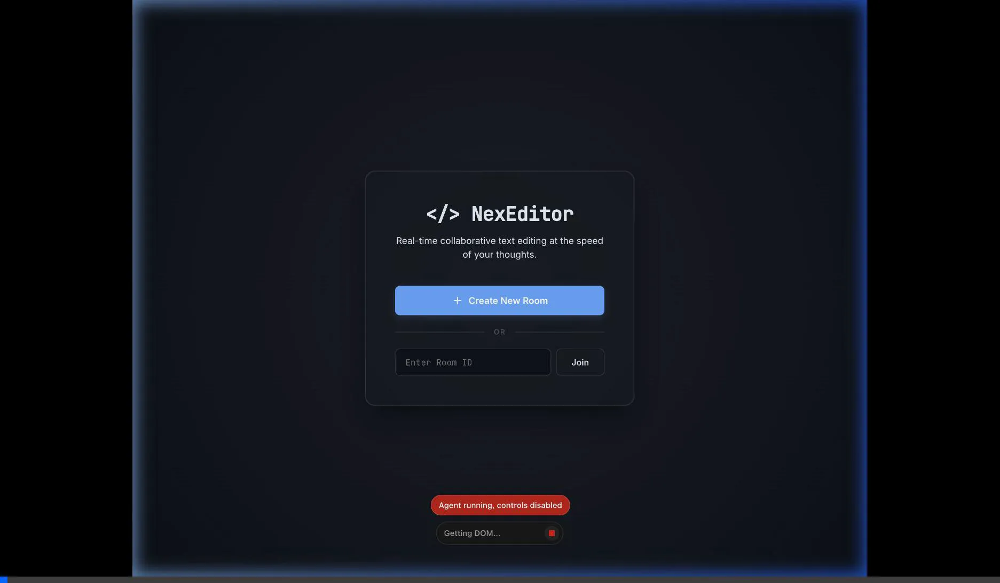

# NexEditor — Real-Time Collaborative Code Editor

NexEditor is a high-performance, real-time collaborative text editor designed for synchronous developer collaboration. Built on a **"Thick Client, Thin Server"** architecture, all algorithmic state resolution, history, and conflict resolution happen at the edge (the users' browsers), while the backend acts strictly as a high-speed, stateless Pub/Sub message relay.

---

## Working Demo

Here is a recording showing multi-client real-time synchronization, user presence tracking, and cursor color sync:



---

## Unique Architectural Highlights

This editor is not a simple text synchronization app. It is engineered with specific distributed systems and UI performance optimizations:

### 1. ID-Anchored Sequence CRDTs
Rather than synchronizing raw strings or relying on index-based offsets (which break during concurrent edits), NexEditor uses **Yjs CRDTs** (`Y.Text`). Every character inserted is assigned a permanently unique identifier linked to its left and right neighbors. This completely eliminates race conditions when multiple users type in the exact same location simultaneously.

### 2. Logical Deletions (Tombstoning)
When a character is deleted, deleting the node immediately from memory would break the CRDT parent-child link chain for concurrent insertions by other peers. Instead, the engine uses **logical deletions (tombstoning)**. Deleted nodes are marked internally as `isDeleted: true`. This preserves the logical tree structure for network synchronization, while the editor binding ensures the deleted content is immediately removed from the view.

### 3. High-Performance CodeMirror 6 Native Binding
The editor is mounted natively to a Vanilla DOM `<div>` using **CodeMirror 6** and `@codemirror/theme-one-dark`. 
* **No Virtual DOM overhead**: We avoid React, Vue, or any other UI wrappers that introduce rendering bottlenecks.
* **Direct transaction bridging**: The official `y-codemirror.next` binding intercepts native CodeMirror transactions and automatically converts them into CRDT updates, while rendering remote user cursors and text selection ranges with near-zero latency.

### 4. Debouncing & Event Aggregation
Emitting a WebSocket packet for every single keystroke is inefficient and leads to socket network congestion. NexEditor features a built-in client-side **batching and debouncing layer**:
* Typing bursts are throttled (50ms debounce window).
* Multiple keystrokes are merged into a single binary CRDT update payload using `Y.mergeUpdates()` before being transmitted over the socket.

### 5. Reconnection Buffering
If a user loses internet connectivity:
* Local edits continue to be registered in the CRDT engine.
* The outgoing network updates are accumulated in a local memory buffer (`reconnectBuffer`).
* Upon reconnection, the buffer is merged and flushed as a single update payload, preventing update storming and resolving conflicts gracefully.

### 6. "Dumb Pipe" Server Philosophy
The server has **zero knowledge** of CRDT mathematics, document structure, or text content. It maintains room mappings and blindly broadcasts binary payloads between peers in the same room. By keeping the server completely "dumb", the system can scale to handle millions of operations with minimal CPU/RAM overhead.

---

## Technology Stack

* **Frontend**: Vanilla JavaScript (ES6+), CodeMirror 6, Yjs, `y-codemirror.next`, `socket.io-client` (ES Modules imported via CDN).
* **Backend**: Node.js, Express, `socket.io`.
* **State Persistence**: 100% Ephemeral (in-memory across connected peer CRDTs. If the last user leaves the room, the document is destroyed).

---

## Project Structure

```
NexEditor/
├── package.json         # Node.js dependencies & npm scripts
├── .gitignore           # Standard git exclusion patterns
├── README.md            # You are here!
├── demo.webp            # Demo animation showing collaborative editing
├── server/
│   └── index.js         # Stateless Express + Socket.io relay server
└── client/
    ├── index.html       # Landing page & collaborative editor UI mount stage
    ├── style.css        # Premium dark mode styles, custom variables, pulse animations
    ├── crdt.js          # Shared Y.Doc, Y.Text type, and Yjs awareness setup
    ├── network.js       # WebSockets connection, 50ms batching, and reconnect buffer
    └── ui.js            # CodeMirror initialization, event routing, and DOM rendering
```

---

## Getting Started

### Prerequisites
* Node.js (version 18 or higher)
* npm

### Installation & Run

1. Clone or download the repository, then navigate to the root directory:
   ```bash
   cd NexEditor
   ```

2. Install the backend dependencies:
   ```bash
   npm install
   ```

3. Start the server in development mode (runs on port 3012 by default):
   ```bash
   npm run dev
   ```

4. Open `http://localhost:3012` in your browser.

### Inviting Collaborators
To share a session and collaborate:

* **Local Machine Testing (Same computer)**:
  Simply open a second browser window/tab at `http://localhost:3012/#<room-id>`.
  
* **Local Network Collaboration (Same Wi-Fi/LAN)**:
  Find your host machine's local IP address (e.g., `192.168.x.x`). Collaborators on the same network can join by navigating to `http://<your-local-ip>:3012/#<room-id>`.

* **Remote Collaboration (Over the Internet)**:
  To share with peers outside your network, deploy the server to a hosting provider (like Render, Railway, or Heroku), or expose your local port using a secure tunneling tool like **ngrok**:
  ```bash
  ngrok http 3012
  ```
  Then share the generated RoomId with your peers.
